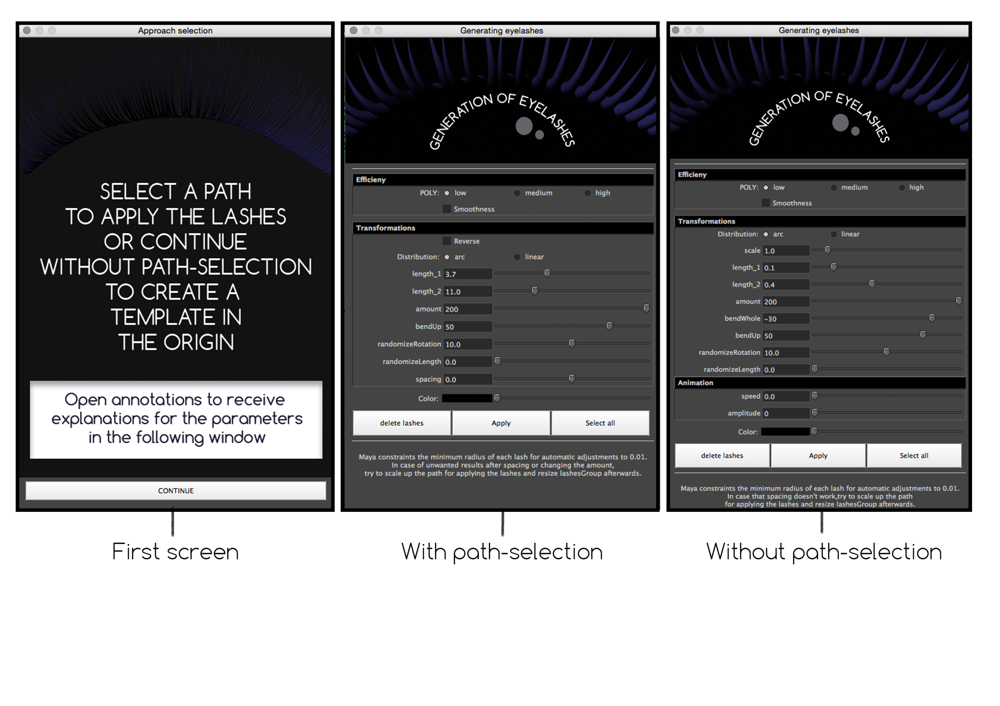
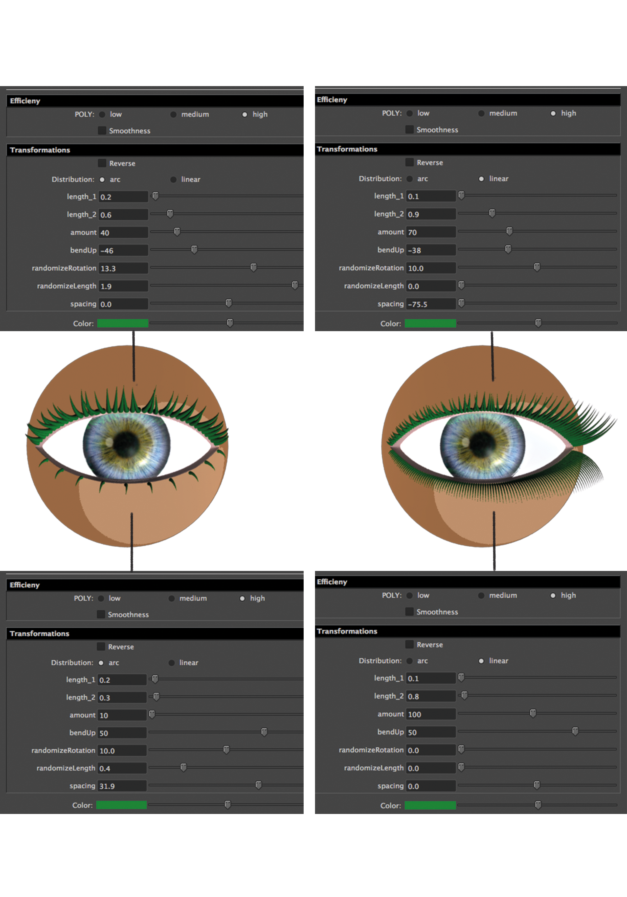

# Tool

Create lashes in 3 steps:
1) Draw a line in Maya
2) Select the line
3) Run the script
The lashes will be applied to the line and can be configured using the pop-up GUI in terms of clumping, amount and bending.

Alternatively, the script can be run without drawing and selecting a line. In that case, a lash line is placed in the center of the scene.

GUI:


Examples:


# Integration

The folder *Lashes* needs to be moved to the scripts-folder of your Maya installation.
The logos in the folder *GUI* need to be moved to the prefs folder of your Maya installation.

Load scripts into Maya with the following Python commands:

```bash
import Lashes.GUI
import Lashes.deformerApproach
import Lashes.deformerWithPath
reload(Lashes.GUI)
reload(Lashes.deformerApproach)
reload(Lashes.deformerWithPath)
Lashes.GUI.GUI.chooseApproach()
```

The code can be added via middle-mouse-button to the shell and be processed from there with a single mouse-click. Alternativly it can be run via the script-editor.
